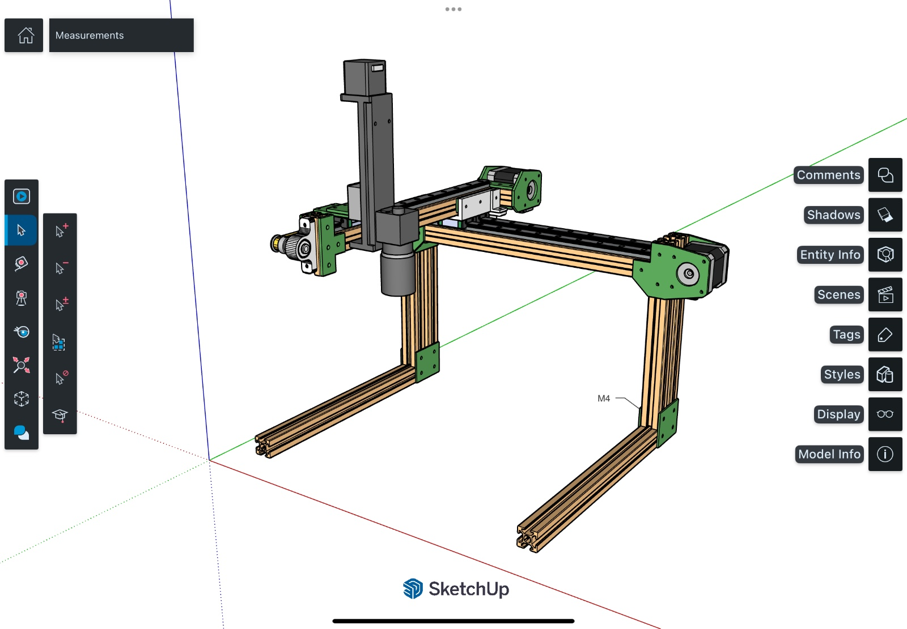
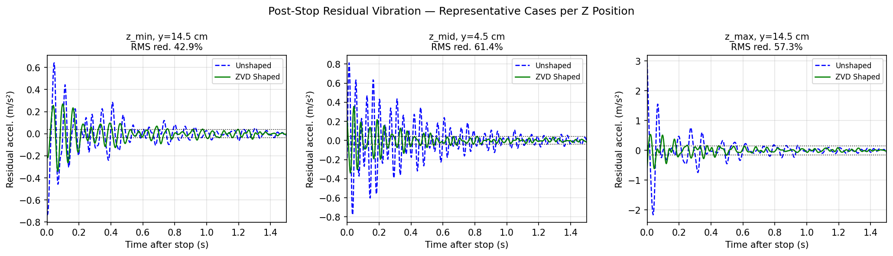
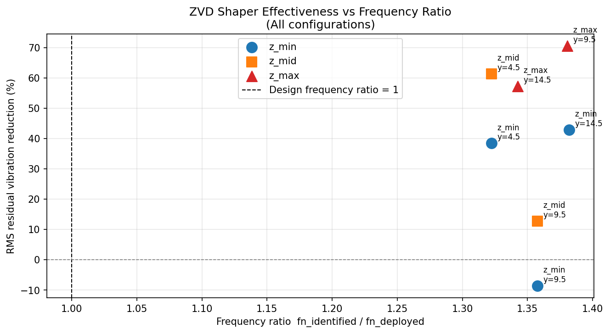

# ZVD Input Shaping for AOI Cartesian Robots

**Capstone Project — Graduate Institute of Intelligent Manufacturing Technology**  
**National Taiwan University of Science and Technology (NTUST)**

> A feedforward vibration suppression system for a PPP Cartesian robot used in Automated Optical Inspection (AOI) of printed circuit boards.

---

## What This Project Does

High-speed point-to-point motion in belt-driven Cartesian robots causes residual vibrations that force the camera head to wait until it settles before capturing an image. This directly limits AOI throughput.

This project implements a **Zero Vibration and Derivative (ZVD) input shaper** on an ESP32 microcontroller that reshapes the motion command *before* it reaches the stepper motor drivers — canceling the dominant vibration before it develops, rather than waiting for it to die out.

**Key results across 7 workspace configurations:**
- RMS residual vibration reduction: **5.3% to 70.7%** (mean: **43.7%**)
- Maximum peak acceleration reduction: **79.1%**

| | Unshaped | ZVD Shaped |
|---|---|---|
| Peak accel (z_min, y=14.5 cm) | ~0.95 m/s² | ~0.20 m/s² |
| Settling behavior | Long oscillation tail | Rapid decay |

---

## System Overview

```
ESP32
  │
  ├── X axis: Step/Dir → Stepper Driver → NEMA 17 → Belt & Pulley → Linear Cart
  ├── Y axis: Step/Dir → Stepper Driver → NEMA 17 → Belt & Pulley → Linear Cart
  └── Z axis: Step/Dir → Stepper Driver → NEMA 17 → Ball Screw → Camera Head
                                                                       │
                                                                   MPU6050
                                                                (accelerometer)
```

The ZVD shaper convolves the trapezoidal position command with a 3-impulse sequence, computed from the experimentally identified natural frequency (fₙ) and damping ratio (ζ) of each axis configuration.

### Robot Photos & CAD



---

## Repository Structure

```
aoi-cartesian-robot-zvd/
│
├── firmware/
│   ├── 1_data_collection/       ← ESP32 code used to collect accelerometer ring-down data
│   │   └── data_collection.ino
│   └── 2_scan_comparison/       ← ESP32 code for full AOI scan (shaped vs. unshaped)
│       └── scan_comparison.ino
│
├── matlab/
│   ├── identify_fn_zeta.m       ← System ID: extract fₙ and ζ from CSV ring-down data
│   └── zvd_simulation.m         ← Simulate ZVD shaper and generate robustness sweep
│
├── python/
│   └── process_results.py       ← Process CSV data → compute metrics → generate figures
│
├── data/
│   └── raw_csv/                 ← Place your accelerometer CSV files here
│       └── README.md
│
├── results/
│   └── figures/                 ← Output figures from python/process_results.py
│
└── docs/
    ├── system_description.md    ← Hardware overview & wiring
    ├── how_to_use.md            ← Step-by-step guide for future students
    └── shaper_theory.md         ← ZVD math explained from scratch
```

---

## Quick Start for Future Students

If you want to **reproduce the experiments** or **continue this research**, follow these steps:

1. **Read [`docs/system_description.md`](docs/system_description.md)** — understand the hardware
2. **Read [`docs/shaper_theory.md`](docs/shaper_theory.md)** — understand the ZVD math
3. **Flash the firmware** from `firmware/1_data_collection/` to collect your own ring-down data
4. **Run the MATLAB script** `matlab/identify_fn_zeta.m` to identify fₙ and ζ from your data
5. **Update the shaper coefficients** in `firmware/2_scan_comparison/scan_comparison.ino`
6. **Flash** the scan comparison firmware and run the experiment
7. **Process your results** with `python/process_results.py`

See **[`docs/how_to_use.md`](docs/how_to_use.md)** for the full step-by-step guide.

---

## Hardware Requirements

| Component | Spec |
|---|---|
| Microcontroller | ESP32 (DevKit V1 or equivalent) |
| Stepper motors | NEMA 17 — 17HS8401 (1.7 A, 0.55 Nm) |
| Stepper drivers | A4988 or DRV8825 (set current to 1.2–1.5 A) |
| Accelerometer | MPU6050 (I2C, connected to GPIO 21/22) |
| X/Y drive | GT2 belt + 20-tooth pulley (2 mm pitch) → **400 steps/cm** |
| Z drive | Ball screw mechanism |
| Framework | PlatformIO (recommended) or Arduino IDE with ESP32 board package |

---

## Key Parameters

| Parameter | Value | How it was obtained |
|---|---|---|
| Mean natural frequency (fₙ) | 15.34 ± 1.9 Hz | FFT of post-stop ring-down (9 trials) |
| Damping ratio (ζ) | 0.032 ± 0.007 | Logarithmic decrement method |
| Deployed shaper fₙ (z_min) | 11.1–11.6 Hz | Empirical trial-and-error tuning |
| Fast move velocity | 30.0 cm/s | Fixed for all scan moves |
| Fast move acceleration | 220.0 cm/s² | Fixed for all scan moves |
| Sampling rate (MPU6050) | 400 Hz | 2500 µs sample period |

> **Note for future students:** There is a known discrepancy between the rigorously identified fₙ (15.34 Hz) and the empirically deployed shaper frequency (11.1 Hz). The ZVD shaper's inherent robustness to frequency uncertainty (±40% window) explains why it remains effective despite this gap. See [`docs/shaper_theory.md`](docs/shaper_theory.md) for details.

---

## Results Summary


*Post-stop residual vibration for representative configurations across all three Z positions.*


*ZVD shaper effectiveness vs. frequency ratio across all 7 configurations.*

---

## Paper

📄 **[Download the full paper (PDF)](https://github.com/demianeev/aoi-cartesian-robot-zvd/blob/main/B260177.pdf)**

---

## Authors

- **Demian Escurra**
- **Luis M. Prieto**
- **Luis E. Vázquez**
- **Shu-Hao Liang**
- **Marnel Altius**

Graduate Institute of Intelligent Manufacturing Technology  
National Taiwan University of Science and Technology, Taipei, Taiwan

**Presented at:** 6th International Conference on Electronic Communications, Internet of Things and Big Data (ICEIB 2026), Tamkang University, New Taipei, Taiwan

---

## License

This project is released for academic use. If you use this work in your own research or capstone project, please cite the original paper:

> Escurra, D.; Prieto, L.M.; Vázquez, L.E.; Liang, S.H.; Altius, M. *Input Shaping for Robust Vibration Suppression in PPP Cartesian Robots with Variable Z-Axis Dynamics for Automated Optical Inspection.* Presented at ICEIB 2026, Tamkang University, Taiwan. [📄 PDF](https://github.com/demianeev/aoi-cartesian-robot-zvd/blob/main/B260177.pdf)
